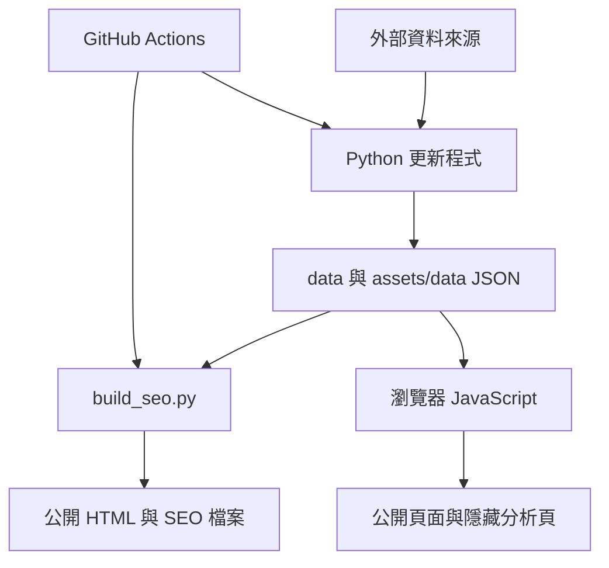

# Wei-Hao Chiu 個人學術網站：架構、檔案與功能維護手冊

> Repository：<https://github.com/weihaochiu/weihaochiu.github.io>  
> 正式網站：<https://weihaochiu.github.io/>  
> 預設分支：`main`  
> 本文件盤點日期：2026-07-21  
> 本文件用途：作為網站的單一架構索引。每次修改網站、資料格式、自動化流程、外部連結或分析功能時，必須同步更新本文件，並完成第 12 節的回歸檢查，避免原有功能遺失。

## 1. 網站定位與技術架構

本網站是部署於 GitHub Pages 的靜態個人學術網站，不使用後端伺服器或資料庫。公開頁面由 HTML、CSS 與 JavaScript 組成；學術成果、引用指標、期刊資料與 Open Access 連結主要儲存在 JSON。Python scripts 配合 GitHub Actions 定期更新外部資料，`scripts/build_seo.py` 再依 JSON 重新產生論文個別頁、SEO metadata、`sitemap.xml`、`robots.txt` 與 `llms.txt`。

主要資料流：

目前 repository 約有 5.3 MB、51 個 HTML、17 個 JSON、12 個 Python、4 個 JavaScript、3 個 CSS、10 個 workflow YAML，以及圖片、說明文件與網站驗證檔。

## 2. 公開頁面與站內路由

| 檔案 | 網址 | 功能 | 主要資料／程式依賴 |
|---|---|---|---|
| `index.html` | `/`、`/index.html` | 首頁、個人簡介、主要統計、精選研究與入口 | `assets/css/styles.css`、`assets/js/app.js`、多個 `data/*.json` |
| `about.html` | `/about.html` | About、Experience、Education、Awards 等整合內容 | `app.js`、`awards.json` |
| `research.html` | `/research.html` | 研究主題、研究領域與代表成果 | `research.css`、`research.js`、`research_areas.json`、`publications.json` |
| `publications.html` | `/publications.html` | 全部論文、研究主題與年份篩選、引用來源、OA PDF、分享 | `app.js`、`publications.json`、taxonomy、Scholar、OpenAlex、Crossref、Mendeley、Unpaywall JSON |
| `publications/*.html` | `/publications/<DOI-slug>.html` | 每篇論文的 SEO 友善個別頁；顯示基本資料、內容欄位與外部按鈕 | 由 `build_seo.py` 依資料 JSON 產生；載入 `../assets/js/app.js` |
| `patents.html` | `/patents.html` | 專利列表、年份統計與外部專利連結 | `app.js`、`patents.json` |
| `projects.html` | `/projects.html` | 計畫列表、角色、期間與外部資料連結 | `app.js`、`projects.json` |
| `awards.html` | `/awards.html` | 舊入口，重新導向 `about.html#awards` | redirect/noindex 頁 |
| `education.html` | `/education.html` | 舊入口，重新導向 `about.html#education` | redirect/noindex 頁 |
| `experience.html` | `/experience.html` | 舊入口，重新導向 `about.html#experience` | redirect/noindex 頁 |
| `404.html` | 不存在的路徑 | GitHub Pages 找不到頁面時的引導頁 | `styles.css` |

固定主導覽連結為 `About`、`Research`、`Publications`、`Patents`、`Projects`。修改任何頁面時，必須確認桌面與行動版導覽一致，且 publication 子頁使用正確的 `../` 相對路徑。

## 3. 非公開導覽的分析頁面

這些頁面沒有放在公開主選單，但知道網址者仍可開啟；它們不是帳號登入保護頁面。

| 檔案 | 功能 | 主要依賴 |
|---|---|---|
| `publication-insights-4d8c7a.html` | Publication Insights：內容完整度、年度論文與引用、Google Scholar／OpenAlex／Crossref 比較、JCR quartile、出版社、IF、合作關係、期刊表格；圖表可切換形式與下載 | D3.js CDN；`publications.json`、`journals.json`、OpenAlex/Crossref publication metrics、Scholar/OpenAlex citation histories |
| `website-insight-ea929558.html` | Website Insights：GA4 流量摘要與 DOI、OA PDF、Google Scholar、OpenAlex、Crossref、ORCID、Email、CV、Share、Patent 等互動事件 | `assets/data/ga-summary.json`、`app.js` |
| `bems-fe5049fb.html` | BEMS 專用 GA4／網站分析頁 | `assets/data/ga-summary.json` 或頁面內指定資料 |

隱藏網址只能降低被一般訪客發現的機率，不能視為真正的存取控制。不要在這些頁面或 JSON 放置密碼、API secret、service-account private key 或其他敏感資料。

## 4. 前端資源

### 4.1 CSS

| 檔案 | 用途 |
|---|---|
| `assets/css/styles.css` | 全站主樣式：layout、header/nav、cards、buttons、publication actions、share menu、responsive、footer、分析元件共用外觀。 |
| `assets/css/research.css` | Research 頁的研究領域、卡片、featured publications 與專屬響應式樣式。 |
| `assets/css/openalex-metrics.css` | OpenAlex metrics 元件樣式；與 `openalex-metrics.js` 搭配。 |

### 4.2 JavaScript

| 檔案 | 用途與不能遺失的功能 |
|---|---|
| `assets/js/app.js` | 全站核心：載入 JSON、導覽列、首頁／About／Publications／Patents／Projects 渲染、年份統計、publication filter、OA 與引用按鈕、Web Share／copy link、GA4 interaction event、footer 版本與更新日期。 |
| `assets/js/research.js` | 載入研究領域與 publication 資料，產生 research cards、代表論文與研究主題內容。 |
| `assets/js/openalex-metrics.js` | 讀取作者層級 OpenAlex metrics，顯示 citations、h-index、i10-index 與更新狀態。 |
| `assets/js/openalex-publications.js` | 將每篇論文對應 OpenAlex work、citation count 與連結；需避免與 HTML/server-generated 按鈕重複渲染。 |

### 4.3 圖片與 PWA 資源

| 路徑 | 用途 |
|---|---|
| `assets/images/profile.webp` | 網頁顯示用個人照片。 |
| `assets/images/profile.jpg` | 其他頁面／metadata 可用的 JPEG 個人照片。 |
| `assets/images/og-profile.jpg` | Open Graph／社群分享預覽圖。 |
| `assets/images/apple-touch-icon.png` | iOS 加入主畫面 icon。 |
| `assets/images/favicon.svg` | 瀏覽器 favicon。 |
| `site.webmanifest` | PWA／瀏覽器安裝與 icon metadata。 |
| `.nojekyll` | 告知 GitHub Pages 不要用 Jekyll 處理，直接發布靜態檔。 |

## 5. Graphical Abstract 資料夾

`GA/` 儲存論文 Graphical Abstract。檔名原則是將 DOI 中 `/` 改成 `_`，例如：

- `GA/10.1039_D3CC04699K.png`
- `GA/10.1016_j.solener.2026.114430.png`
- `GA/10.1016_j.mtener.2026.102359.png`
- `GA/10.1016_j.seppur.2025.134157.png`

實際顯示路徑以 `data/publications.json` 的 `graphicalAbstract` 為準。新增、改名或刪除 GA 時，必須同步更新該欄位、`graphicalAbstractAlt`、個別論文頁與 Content completeness 統計。若出版社確實沒有 GA，應在 `contentStatus` 中標記已查核狀態，不能只留空而一直被列為 missing。

## 6. JSON 資料檔與資料擁有權

### 6.1 人工維護的核心內容

| 檔案 | 結構／用途 | 主要消費者 |
|---|---|---|
| `data/publications.json` | 37 篇論文的單一核心資料源。欄位含 title、authors、DOI、日期、journal、publisher、topic/tags、citation、abstract、highlights、keywords、GA、contentStatus、Scholar 連結等。 | Publications、Research、首頁、個別論文頁、Insights、所有 citation/OA 更新 scripts、SEO build |
| `data/publication_taxonomy.json` | category labels、theme options 與每篇 publication 分類 mapping。 | Publications filter、分類一致性 |
| `data/patents.json` | 14 筆專利；含中英文名稱、發明人、assignee、jurisdiction、number、status、date、URL。 | Patents、首頁統計 |
| `data/projects.json` | 4 筆計畫；含中英文標題、機構、計畫編號、期間、角色、scope、URL。 | Projects、首頁統計 |
| `data/awards.json` | 10 筆獎項；含中英文標題、機構、獲獎人、作品、日期、type、URL。 | About/Awards、首頁統計 |
| `data/research_areas.json` | Research 頁的研究領域、內容與代表論文設定。 | `research.js` |
| `data/site_meta.json` | 網站 version、lastUpdated 與 notes。 | footer、SEO build |

### 6.2 自動或半自動更新的 metrics

| 檔案 | 資料內容 | 產生程式／來源 |
|---|---|---|
| `data/scholar_metrics.json` | Google Scholar 作者層級 citations、h-index、i10-index、狀態與更新時間。 | `update_scholar.py`；Google Scholar profile |
| `data/google_scholar_citation_history.json` | Google Scholar 年度引用歷史與總指標。 | `update_google_scholar_citation_history.py` |
| `data/openalex_metrics.json` | OpenAlex 作者層級 citations、h-index、i10-index。 | `update_openalex_stats.py`；OpenAlex author `A5007707999` |
| `data/openalex_publication_metrics.json` | DOI 對應 OpenAlex work、每篇 cited-by count、verified/not-found 狀態。 | `update_openalex_publications.py` |
| `data/openalex_citation_history.json` | 依年份彙整 OpenAlex 引用、validation difference、無法分配與排除資料。 | `update_openalex_citation_history.py` |
| `data/crossref_publication_metrics.json` | DOI 對應 Crossref `is-referenced-by-count` 與驗證狀態。 | `update_crossref_publications.py` |
| `data/mendeley_metrics.json` | 每篇 DOI 的 Mendeley readers、catalogue 連結、fresh/stale/not-found/error 狀態。 | `update_mendeley.py`；Mendeley API |
| `data/unpaywall.json` | DOI 對應合法 OA 狀態、best OA location 與 PDF URL。 | `update_unpaywall.py`；Unpaywall API |
| `data/journals.json` | 期刊、ISSN、publisher、JIF、5-year IF、JCR quartile、category、來源政策與更新時間。 | `update_journals.py`；JCR/公開來源與既有資料 |
| `assets/data/ga-summary.json` | GA4 page views、users、sessions、country/device/page 與自訂互動事件摘要。 | `export_ga4_summary.py`；GA4 Data API |

`data/README_KEEP_EXISTING_JSON.txt` 是資料保留提醒，更新 ZIP 或合併檔案時不可誤刪既有 JSON。

## 7. Python scripts

| 檔案 | 功能 | 重要輸入 → 輸出 |
|---|---|---|
| `scripts/build_seo.py` | 全站產生器：統一 GA4、canonical、Open Graph、Twitter、Person/ScholarlyArticle JSON-LD、citation meta；產生／更新 publication 個別頁、`sitemap.xml`、`robots.txt`、`llms.txt` 與部分 HTML。 | `publications.json` + metrics/OA/site meta → HTML 與 SEO 檔 |
| `scripts/update_scholar.py` | 更新 Scholar 作者 metrics，並可能更新 publication citation 欄位／連結。 | Scholar profile + publications → `scholar_metrics.json`、`publications.json` |
| `scripts/update_google_scholar_citation_history.py` | 抓取／整理 Scholar 年度引用資料。 | Scholar profile → Scholar history JSON |
| `scripts/update_openalex_stats.py` | 更新 OpenAlex 作者總 citations、h-index、i10-index。 | OpenAlex author API → `openalex_metrics.json` |
| `scripts/update_openalex_publications.py` | 逐 DOI 對應 OpenAlex work 並驗證 citation 數與 URL。 | publications + OpenAlex API → publication metrics JSON |
| `scripts/update_openalex_citation_history.py` | 整理 OpenAlex works 與年度 citation histories，保留驗證與例外資訊。 | publications/OpenAlex metrics/API → history JSON |
| `scripts/update_crossref_publications.py` | 逐 DOI 查 Crossref metadata 與 citation count。 | publications + Crossref API → Crossref metrics JSON |
| `scripts/update_mendeley.py` | 逐 DOI 查 reader count 與 catalogue URL，處理 token、重試、stale/error。 | publications + Mendeley credentials/API → Mendeley JSON |
| `scripts/test_mendeley_api.py` | 診斷 Mendeley API credentials、token 與 DOI lookup，不修改正式資料。 | repository secrets/API → console test report |
| `scripts/update_unpaywall.py` | 查 OA 狀態並選擇可公開使用的 PDF landing/PDF URL。 | publications + Unpaywall API → `unpaywall.json` |
| `scripts/update_journals.py` | 大型期刊資料更新器；彙整期刊識別、JCR profile、IF、quartile、來源與保留政策。 | publications + journal sources + existing JSON → `journals.json` |
| `scripts/export_ga4_summary.py` | 透過 GA4 Data API 匯出網站與互動事件摘要；敏感憑證只由 GitHub Secrets／環境變數提供。 | GA4 property/credentials → `assets/data/ga-summary.json` |
| `scripts/requirements.txt` | citation/OA scripts 的 Python dependencies。 | pip install 用 |
| `requirements-ga4.txt` | GA4 export 專用 dependencies。 | pip install 用 |

`scripts/__pycache__/update_openalex_publications.cpython-313.pyc` 是 Python cache，不是原始碼也不應作為部署依賴；後續可在安全確認後移出版本控制並由 `.gitignore` 排除。

## 8. GitHub Actions 自動化

所有 cron 使用 UTC；台灣時間為 UTC+8。workflow 具有 `contents: write` 者會將更新結果直接 commit 回 `main`。

| Workflow | 觸發時間 | 執行內容 | 主要輸出 |
|---|---|---|---|
| `build-seo.yml` | 手動 | 執行與驗證 `build_seo.py`，提交 HTML、publication pages、app.js、site meta 與 SEO files | 公開頁與 SEO |
| `update-openalex-stats.yml` | 每日 02:17 UTC（台灣 10:17）＋手動 | 作者與逐篇 OpenAlex metrics | `openalex_metrics.json`、`openalex_publication_metrics.json` |
| `update-crossref.yml` | 每週一 02:37 UTC（台灣 10:37）＋手動 | 更新 Crossref、重建 SEO/論文頁 | Crossref JSON、publication HTML、SEO files |
| `update-scholar.yml` | 每週一 04:00 UTC（台灣 12:00）＋手動 | 更新 Scholar metrics 與 publication 資料 | Scholar JSON、`publications.json` |
| `update-mendeley.yml` | 每週一 04:20 UTC（台灣 12:20）＋手動 | 更新 Mendeley readers | Mendeley JSON |
| `update-unpaywall.yml` | 每週日 18:00 UTC（週一台灣 02:00）＋手動 | 更新 OA links | Unpaywall JSON |
| `update-citation-histories.yml` | 每週日 22:17 UTC（週一台灣 06:17）＋手動 | 更新 Scholar/OpenAlex 年度 citation histories | 兩個 history JSON |
| `update-ga4-summary.yml` | 每日 01:20 UTC（台灣 09:20）＋手動 | 匯出 GA4 summary | `assets/data/ga-summary.json` |
| `update-journals.yml` | 每月 1 日 03:17 UTC（台灣 11:17）＋手動 | 更新 journal/JCR metadata | `journals.json` |
| `test-mendeley-api.yml` | 手動 | 只做 Mendeley API 診斷 | 不提交正式資料 |

重要維護規則：只要某個 workflow 更新的 JSON 會影響靜態生成的 publication 頁，就必須在同一 workflow 執行 `build_seo.py` 並把所有生成檔加入 `git add`；否則 JSON 與 HTML 會不同步。

## 9. SEO、搜尋引擎與 AI 可讀性

| 檔案／功能 | 用途 |
|---|---|
| `sitemap.xml` | 列出應被搜尋引擎索引的主頁與各 publication 個別頁。 |
| `robots.txt` | 允許／限制 crawler，並指向 sitemap。 |
| `llms.txt` | 提供網站與學術成果的文字索引，改善 AI crawler 理解。 |
| HTML canonical | 避免同頁多網址造成重複內容。 |
| Open Graph／Twitter metadata | 社群分享標題、描述與圖片。 |
| Person JSON-LD | 作者身份、任職、研究主題、Scholar、ORCID、Scopus、WoS、OpenAlex 等 sameAs。 |
| ScholarlyArticle JSON-LD | 每篇論文的 title、authors、journal、DOI、publication date、citation 等結構化資料。 |
| `citation_*` meta | Google Scholar 等學術 crawler 可讀 metadata。 |
| `google3c47e58680c26ffa.html` | Google Search Console 網站所有權驗證檔，不可改名或刪除。 |

`scripts/build_seo.py` 是上述 metadata 的主要來源。不要只手動改生成後的 publication HTML；下次 build 會覆蓋。應先修改 JSON 或 generator，再重新生成。

## 10. 外部服務與連結規則

| 服務 | 用途 | 連結／識別資訊 |
|---|---|---|
| DOI | 出版社永久識別 | `https://doi.org/<DOI>` |
| Google Scholar | 作者總 metrics、逐篇 citation/search/cited-by | 作者 profile ID `ZYbNQb8AAAAJ`；逐篇優先使用已驗證 `scholarCitedByUrl`，否則用 title query |
| OpenAlex | 作者與逐篇 citations | author `A5007707999`；逐篇使用實際 work URL |
| Crossref | DOI metadata 與 `is-referenced-by-count` | 顯示按鈕必須指向可用的 DOI／Crossref work/search URL，不可拼成錯誤 API 頁 |
| Mendeley | reader count 與 catalogue | 優先使用 API 回傳的 catalogue URL |
| Unpaywall | 合法 Open Access PDF | 只在有可用 OA location 時顯示 Open Access PDF |
| Web of Science | 作者／論文搜尋入口 | 沒有 API 數值時可提供搜尋按鈕，但不可假造 citation count |
| ORCID | 作者識別 | `https://orcid.org/0000-0003-4484-3117` |
| GA4 | 流量與 interaction events | measurement ID `G-G82XWMCJDE`；credentials 不得寫入 repository |
| D3.js | Publication Insights 圖表 | 由 CDN 載入；需測試 CDN 無法載入時的狀態提示 |
| Google Fonts | Source Serif 4、Inter、Noto Sans TC | 外部 fonts CDN |

論文按鈕顯示格式應統一為：`DOI ↗`、`N Google Scholar citation(s) ↗`、`N OpenAlex citation(s) ↗`、`N Crossref citation(s) ↗`、`N Mendeley reader(s) ↗`。單複數要正確，沒有可靠數值時不要顯示假的 `0`。

## 11. 說明與歷史文件

| 檔案 | 內容 |
|---|---|
| `README.md` | repository 基本說明。 |
| `WEBSITE_REQUIREMENTS.md` | 使用者對網站內容、維護方式與功能的持續需求；更新網站前必讀。 |
| `RESEARCH_UPDATE_README.md` | Research 區更新說明。 |
| `OPENALEX_STATS_SETUP.md` | OpenAlex 作者 metrics 設定。 |
| `OPENALEX_PUBLICATION_CITATIONS_SETUP.md` | OpenAlex 逐篇 citation 設定。 |
| `UNPAYWALL_SHARE_SETUP.md` | Unpaywall 與 share 功能設定。 |
| `BEMS_GA4_SETUP.md` | BEMS／GA4 設定。 |
| `README_v22.txt`、`README_v23.txt` | v22/v23 版本說明。 |
| `V20_CHANGELOG.md`、`V21_CHANGELOG.md`、`V23_CHANGELOG.md` | 各版本變更紀錄。 |

本文件描述「目前架構」，changelog 描述「歷史變更」，`WEBSITE_REQUIREMENTS.md` 描述「必須持續遵守的需求」；三者用途不同，不應互相取代。

## 12. 每次更新必做的功能回歸檢查

### 12.1 資料與生成一致性

- [ ] JSON 全部能被正確解析，沒有 trailing comma、錯誤 encoding 或重複 key。
- [ ] `publications.json` 的 DOI 不重複；每篇 DOI 都有唯一 slug 與個別 HTML。
- [ ] Publication 數量、首頁統計、publication 列表、個別頁與 sitemap 數量一致。
- [ ] Patent、Project、Award 的首頁數字與 JSON 筆數一致。
- [ ] 修改 generator 或 metrics 後已執行 `scripts/build_seo.py`，且沒有未預期的生成差異。
- [ ] `site_meta.json` 的 version／lastUpdated 與 footer 顯示同步。
- [ ] 新增／移除檔案後已更新本文件的檔案表、數量與依賴說明。

### 12.2 導覽與頁面

- [ ] `index.html` 五個主導覽均可開啟正確頁面。
- [ ] 行動版 Menu 可展開、關閉，ARIA `expanded` 狀態正確。
- [ ] 舊入口 `experience.html`、`education.html`、`awards.html` 正確導向 About anchors。
- [ ] 每篇 publication 頁的 `Return to publications` 回到正確 publication anchor。
- [ ] `404.html` 能引導使用者回首頁。
- [ ] 隱藏 Insights 頁仍可直接開啟，但未出現在公開主導覽／sitemap（除非需求改變）。

### 12.3 Publications 核心功能

- [ ] 年份／研究主題 filter 可用，切換後筆數與 URL anchor 正確。
- [ ] 每篇 publication 從列表可開啟個別頁。
- [ ] DOI 連結實際開啟該 DOI。
- [ ] Google Scholar、OpenAlex、Crossref、Mendeley 的數字、名稱、單複數與按鈕格式一致。
- [ ] OpenAlex 按鈕不重複出現。
- [ ] Crossref 不是錯誤 API response 頁，且逐篇抽樣點擊驗證。
- [ ] Web of Science 未使用 API 時只顯示搜尋連結，不顯示未驗證數字。
- [ ] OA PDF 只在 Unpaywall／出版社確認為合法 OA 時顯示，且連結不是 404／登入錯誤頁。
- [ ] Abstract、Highlights、Graphical Abstract、Keywords 依指定順序顯示；查核為不存在者不列入 missing。
- [ ] GA 圖存在、alt text 正確、行動版不超出畫面。
- [ ] Share menu、Copy link、Email、LinkedIn 與原生 Web Share 正常。

### 12.4 Citation 與 Insights

- [ ] 首頁 Google Scholar／OpenAlex citations、h-index、i10-index 顯示來源清楚且沒有同一指標重複。
- [ ] Publication Insights 所有 JSON 成功載入；錯誤時有可理解的 status message。
- [ ] Publications 與 Citations 混合圖使用雙 Y 軸或適合的獨立尺度，publication 不會因 citation 數量級而看不見。
- [ ] 圖表線圖／長條圖切換、legend、tooltip、下載 PNG/CSV 功能可用。
- [ ] Google Scholar／OpenAlex／Crossref 比較使用相同 DOI 集合與清楚的更新日期。
- [ ] Missing Abstract／Highlights／GA／Keywords 統計與 `contentStatus` 規則一致。

### 12.5 Analytics 與事件追蹤

- [ ] GA4 tag 在公開頁與所有新 publication 頁只載入一次。
- [ ] DOI、OA PDF、Google Scholar、OpenAlex、Crossref、ORCID、Email、CV、Share、Patent clicks 都送出預期 event。
- [ ] `export_ga4_summary.py` 查詢的 event name 與 `app.js` 實際送出的完全一致。
- [ ] `website-insight-ea929558.html` 能顯示每種事件；無資料時顯示 0／無資料狀態而非 JavaScript error。
- [ ] repository、HTML、JSON 與 log 中沒有 GA service-account JSON/private key。

### 12.6 SEO 與品質

- [ ] canonical、OG URL、JSON-LD URL 全部使用正式 `https://weihaochiu.github.io/`。
- [ ] 每頁 title/description 唯一且內容正確；publication 頁包含 `citation_*` metadata。
- [ ] `sitemap.xml` 只列有效可索引頁，`robots.txt` 指向正確 sitemap。
- [ ] `llms.txt` 與網站的 publication／profile 資訊同步。
- [ ] Google verification file 保留。
- [ ] 內部相對連結、圖片、CSS、JS、JSON 全部無 404。
- [ ] 外部重要連結至少抽樣測試 DOI、OA、Scholar、OpenAlex、Crossref、Mendeley、ORCID、Scopus、WoS。
- [ ] 桌面與手機寬度均檢查 layout，並確認鍵盤可操作與基本 accessibility。

## 13. 標準更新流程

1. 先讀 `WEBSITE_REQUIREMENTS.md` 與本文件，確認既有需求及影響範圍。
2. 從最新版 `main` 開始，不使用舊 ZIP 覆蓋新 repository。
3. 修改「真正的資料源」：內容優先改 JSON，生成規則改 Python，互動改 JS，外觀改 CSS；避免只手改生成頁。
4. 若改動 publications、metrics、SEO 或 link rendering，執行 `scripts/build_seo.py`。
5. 執行 JSON parse、Python syntax、內部連結與重複 DOI／重複按鈕檢查。
6. 依第 12 節測試受影響功能，並抽樣測試不應受影響的核心功能。
7. 更新 `data/site_meta.json`、適用的 changelog、`WEBSITE_REQUIREMENTS.md`（若需求改變）與本文件。
8. 比對 Git diff，確認沒有把 secrets、cache、臨時檔或無關檔案提交。
9. 交付時列出實際修改檔；若提供下載檔，即使只有一個檔案，也必須包成 ZIP。

## 14. 檔案完整清單

### Root

`.nojekyll`、`404.html`、`about.html`、`awards.html`、`bems-fe5049fb.html`、`education.html`、`experience.html`、`google3c47e58680c26ffa.html`、`index.html`、`llms.txt`、`patents.html`、`projects.html`、`publication-insights-4d8c7a.html`、`publications.html`、`research.html`、`robots.txt`、`site.webmanifest`、`sitemap.xml`、`website-insight-ea929558.html`。

說明文件：`README.md`、`README_v22.txt`、`README_v23.txt`、`BEMS_GA4_SETUP.md`、`OPENALEX_PUBLICATION_CITATIONS_SETUP.md`、`OPENALEX_STATS_SETUP.md`、`RESEARCH_UPDATE_README.md`、`UNPAYWALL_SHARE_SETUP.md`、`V20_CHANGELOG.md`、`V21_CHANGELOG.md`、`V23_CHANGELOG.md`、`WEBSITE_REQUIREMENTS.md`、本文件 `WEBSITE_ARCHITECTURE.md`。

### `.github/workflows/`

`build-seo.yml`、`test-mendeley-api.yml`、`update-citation-histories.yml`、`update-crossref.yml`、`update-ga4-summary.yml`、`update-journals.yml`、`update-mendeley.yml`、`update-openalex-stats.yml`、`update-scholar.yml`、`update-unpaywall.yml`。

### `assets/`

- CSS：`assets/css/styles.css`、`assets/css/research.css`、`assets/css/openalex-metrics.css`
- JavaScript：`assets/js/app.js`、`assets/js/research.js`、`assets/js/openalex-metrics.js`、`assets/js/openalex-publications.js`
- Data：`assets/data/ga-summary.json`
- Images：`assets/images/profile.webp`、`assets/images/profile.jpg`、`assets/images/og-profile.jpg`、`assets/images/apple-touch-icon.png`、`assets/images/favicon.svg`

### `data/`

`README_KEEP_EXISTING_JSON.txt`、`awards.json`、`crossref_publication_metrics.json`、`google_scholar_citation_history.json`、`journals.json`、`mendeley_metrics.json`、`openalex_citation_history.json`、`openalex_metrics.json`、`openalex_publication_metrics.json`、`patents.json`、`projects.json`、`publication_taxonomy.json`、`publications.json`、`research_areas.json`、`scholar_metrics.json`、`site_meta.json`、`unpaywall.json`。

### `scripts/`

`build_seo.py`、`export_ga4_summary.py`、`requirements.txt`、`test_mendeley_api.py`、`update_crossref_publications.py`、`update_google_scholar_citation_history.py`、`update_journals.py`、`update_mendeley.py`、`update_openalex_citation_history.py`、`update_openalex_publications.py`、`update_openalex_stats.py`、`update_scholar.py`、`update_unpaywall.py`，以及非必要 cache `__pycache__/update_openalex_publications.cpython-313.pyc`。

### `publications/`

目前 37 個 DOI 個別頁：

`10-1002-adfm-202306367.html`、`10-1002-advs-202410666.html`、`10-1002-asia-202300681.html`、`10-1002-asia-202500719.html`、`10-1002-asia-70245.html`、`10-1002-solr-202300988.html`、`10-1002-solr-202500538.html`、`10-1016-j-cej-2021-131609.html`、`10-1016-j-cej-2022-139926.html`、`10-1016-j-cej-2024-153974.html`、`10-1016-j-cej-2026-177494.html`、`10-1016-j-electacta-2010-07-061.html`、`10-1016-j-jece-2023-111741.html`、`10-1016-j-jpowsour-2010-12-063.html`、`10-1016-j-jpowsour-2011-06-049.html`、`10-1016-j-jpowsour-2012-05-079.html`、`10-1016-j-jpowsour-2012-12-094.html`、`10-1016-j-jpowsour-2023-233496.html`、`10-1016-j-jpowsour-2025-239216.html`、`10-1016-j-mtchem-2024-102329.html`、`10-1016-j-mtener-2026-102359.html`、`10-1016-j-optcom-2004-10-003.html`、`10-1016-j-orgel-2023-106847.html`、`10-1016-j-seppur-2025-134157.html`、`10-1016-j-solener-2026-114430.html`、`10-1016-j-solmat-2009-07-017.html`、`10-1016-j-solmat-2025-114015.html`、`10-1016-j-tsf-2009-11-058.html`、`10-1021-jp805239k.html`、`10-1039-b902595m.html`、`10-1039-c0jm04099a.html`、`10-1039-d3cc04699k.html`、`10-3390-nano11061607.html`、`10-3390-nano11082125.html`、`10-3390-nano12152651.html`、`10-3390-polym13234246.html`、`10-3390-polym14081580.html`。

這些頁面原則上全部由 `scripts/build_seo.py` 管理。新增論文時，應由 DOI 產生一致 slug，重新 build，並確認舊頁沒有殘留、重複或漏列。

## 15. 本文件的維護規則

以下任一變更發生時，必須在同一批修改中更新本文件：

- 新增、刪除、改名或移動任何 repository 檔案／資料夾。
- 新增或移除頁面、導覽、隱藏分析頁或外部服務。
- 修改 JSON schema、欄位意義、資料擁有者或產生來源。
- 修改 JavaScript 功能、GA4 event name、citation/OA/link 顯示規則。
- 修改 Python script 的輸入、輸出或生成範圍。
- 修改 workflow 的排程、secret、權限、提交檔案或依賴。
- 修改 SEO、structured data、robots、sitemap、llms 或 verification。
- 修改 publication、patent、project、award、GA 的數量或維護規則。

更新完成後，將「本文件盤點日期」改成實際日期，並在 git diff 中確認本文件確實隨功能變更一起更新。
